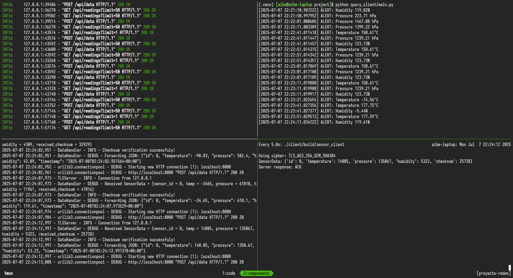
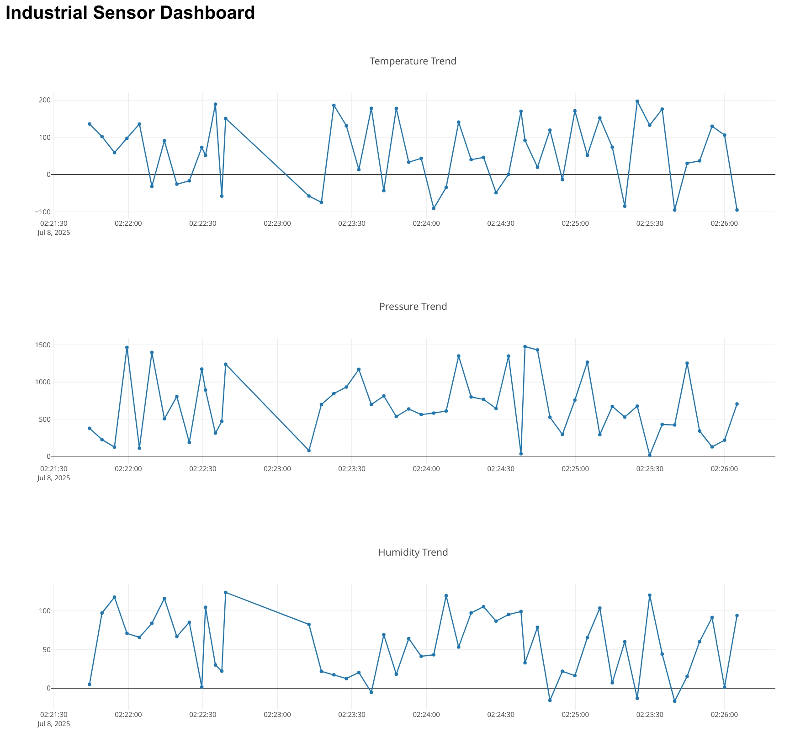

# **Informe Proyecto Semestral: Plataforma IoT Distribuida y Segura para Monitoreo Industrial**

**Alumno**: Alonso Bustos Espinoza

**Fecha**: 07.07.2025

**Curso**: Redes de Computadores

## **Introducción**

Los sistemas distribuidos y el Internet de las Cosas (IoT) son fundamentales en entornos industriales modernos, ya que permiten monitorear y controlar procesos en tiempo real, mejorando la eficiencia y seguridad. Este proyecto busca implementar un sistema distribuido que simule un entorno IoT industrial, integrando componentes escritos en C++ y Python para la transmisión, almacenamiento y visualización de datos de sensores (temperatura, presión y humedad).

El propósito es demostrar cómo un sistema heterogéneo puede comunicarse de manera segura, garantizando la integridad de los datos mediante cifrado y verificaciones de checksum, además de proporcionar una interfaz para visualización y alertas.

## **Descripción del Problema**

En entornos industriales, es crucial recolectar y analizar datos de sensores de manera confiable. Sin embargo, existen desafíos como:

- **Interoperabilidad**: Diferentes lenguajes y protocolos (C++, Python, TCP, Modbus/OPC UA).
- **Seguridad**: Riesgo de manipulación de datos en transmisiones no cifradas.
- **Visualización**: Necesidad de una interfaz accesible para monitoreo en tiempo real.

Este proyecto aborda estos problemas mediante un sistema distribuido con:

- Un **cliente sensor en C++** que envía datos binarios cifrados.
- Un **servidor intermedio en Python** que valida y transforma los datos.
- Un **servidor final con API REST** para almacenamiento y visualización web.
- Un **cliente de consulta** que detecta anomalías.

## **Objetivos**

### **Objetivo General**

Diseñar e implementar un sistema distribuido seguro para el monitoreo industrial, integrando sensores simulados, procesamiento intermedio, almacenamiento persistente y visualización.

### **Objetivos Específicos**

1. **Cliente en C++**:

   - Generar datos simulados (temperatura, presión, humedad).
   - Enviar datos binarios con checksum CRC-16 y cifrado TLS.

2. **Servidor Intermedio (Python)**:

   - Recibir y validar datos mediante checksum CRC-16.
   - Transformar datos binarios a JSON y reenviarlos al servidor final.

3. **Backend en Python**:

   - Almacenar datos en SQLite.
   - Exponer una API REST para consultas.

4. **Cliente de Consulta**:

   - Monitorear datos periódicamente.
   - Generar alertas si los valores están fuera de rango.

5. **Visualización Web**:
   - Mostrar métricas en tiempo real mediante un [dashboard](http://localhost:8000/api/dashboard).

## **Metodología**

### **Arquitectura del Sistema**

El sistema sigue este flujo:

1. **Cliente Sensor (C++)** → **Servidor Intermedio (Python)**

   - Comunicación: **Sockets TCP con TLS** (cifrado punto a punto).
   - Formato de datos: **Estructura binaria** (`SensorData` con checksum CRC-16).

2. **Servidor Intermedio** → **Servidor Final (Python/FastAPI)**

   - Comunicación: **HTTP/REST** (JSON textual).
   - Almacenamiento: **SQLite** (tabla `sensor_data`).

3. **Cliente de Consulta**
   - Consulta la API cada 10 segundos y alerta sobre anomalías.

### **Implementación de Componentes**

#### **Cliente Sensor (C++)**

- Genera datos aleatorios con `create_fake_sensor_data()`.
- Calcula checksum con CRC-16 (`compute_checksum`).
- Envía datos cifrados via TLS (certificados OpenSSL).

#### **Servidor Intermedio (Python)**

- Usa `TLSServer` para recibir datos binarios.
- Valida checksum CRC-16 y convierte a JSON (`DataHandler`).
- Reenvía al servidor final mediante `requests.post()`.

#### **Servidor Final (FastAPI)**

- Almacena datos en SQLite:
  ```sql
  CREATE TABLE sensor_data (
      id INTEGER,
      timestamp DATETIME,
      temperature REAL,
      pressure REAL,
      humidity REAL,
      PRIMARY KEY (id, timestamp)
  )
  ```
- API REST:
  - `POST /data`: Guarda nuevos datos.
  - `GET /readings`: Devuelve los últimos 100 registros.

#### **Cliente de Consulta**

- Verifica rangos seguros:
  ```python
  if not (TEMP_MIN <= temperatura <= TEMP_MAX):
      print(f"ALERTA: Temperatura fuera de rango: {temperatura}°C")
  ```

### **Comunicación entre Componentes**

- **TCP + TLS**: Usado entre C++ y Python (servidor intermedio).
- **HTTP/REST**: Para comunicación textual (servidor intermedio → final).
- **Protocolos Industriales**: Se consideró añadir Modbus, pero se priorizó TLS por simplicidad.

## **Resultados**

- **Funcionamiento del Sistema**:

  - El cliente C++ envía datos de sensores creados aleatoriamente.
  - El servidor intermedio valida y reenvía al servidor final.
  - El cliente consultor accede la API REST para leer ultimas lecturas y alertar en caso de fuera de rangos predefinidos.

- **Visualización**:

  - Componentes:
   _(Logs en terminal de servidores final/medio y clientes sensor/consultor)_.

  - Dashboard:
   _(Gráficos de temperatura, presión y humedad en tiempo real)_.

## **Conclusiones y Trabajo Futuro**

### **Conclusiones**

- Se logró un sistema funcional con comunicación segura (TLS) y validación de integridad (checksum CRC-16).
- La arquitectura distribuida demostró ser escalable para entornos industriales.

### **Trabajo Futuro**

1. **Protocolos Industriales**: Implementar Modbus o OPC UA para mayor compatibilidad.
2. **Mayor Robustez**:
   - Reintentos automáticos si un servidor falla.
   - Persistencia en el servidor intermedio (ej. Redis).
3. **Mejor Visualización**: Usar WebSockets para actualización en tiempo real.
